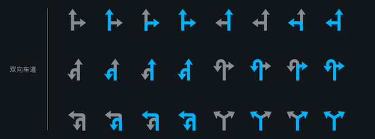

# LBS接口文档

## 一、概述

LBS接口对外提供的类统一为一个，即``MapAutoService``，位于``com.baidu.naviauto.sdk.api``包下，整个接口主要包含两部分，一部分是外部获取地图数据，另一部分是外部向地图      

## 二、接口使用

将SDK文件导入项目，在``build.gradle``文件中添加SDK的依赖即可，同时SDK依赖``gson``进行数据解析，所以还需添加``gson``的依赖，依赖添加示例如下：

```
implementation "com.google.code.gson:gson:2.8.0"
implementation files('libs/lbs-service-sdk-1.0.x.aar')
```

### 2.1 获取地图数据

获取地图数据之前，需要初始化SDK，相关代码如下：

```java
MapAutoService.getInstance().init(context, packageName, initParam, new  			  	OnInitStateChangeListener() {
  @Override
  public void onSuccess() {
		// 初始化成功
  }

  @Override
  public void onFailure(int errorCode, String errorMessage) {
		// 初始化失败
  }
});
```

此外，外部还可自行实现数据传输的通道，实现接口``IChannel``即可，然后在初始化时使用下面带通道参数的初始化方法即可，如下：

```java
MapAutoService.getInstance().init(this,channelImpl, getPackageName(), null, new OnInitStateChangeListener() {
  @Override
  public void onSuccess() {
		// 初始化成功
  }

  @Override
  public void onFailure(int errorCode, String errorMessage) {
		// 初始化失败
  }
});
```

由于初始化是异步操作，后续所有接口的执行，都需要在初始化成功之后再执行，否则所有接口将无法执行，建议将初始化时机放在``Application``的``onCreate``方法里。

### 2.2 向地图提供数据

若需要向地图提供所依赖的数据，例如车速、汽车档位信息等，则使用``providerSystemData``方法，传入``ISystemDataAPI``接口的实现类即可，示例如下：

```java
MapAutoService.getInstance().providerSystemData(new ISystemDataAPI() {
  // 具体的接口实现
});
```

## 三、接口功能对应清单

下面分模块介绍各接口和功能的对应关系，具体的接口参数、返回值等接口细节请参考详细的JavaDoc文档。

### 3.1 底图控制模块

| 功能                             | 方法名                    |
| -------------------------------- | ------------------------- |
| 打开地图                         | openMap                   |
| 地图退到后台                     | backToBackground          |
| 退出地图，杀掉地图进程           | exitMap                   |
| 更新路线偏好                     | updateRoutePlanPreference |
| 纠正路线（eg：在桥上、在辅路等） | correctNaviRoute          |
| 个性化路线（eg：不走xxx路）      | customNaviRoute           |
| 刷新当前路线                     | refreshRoute              |
| 是否开启全览模式                 | setFullRouteView          |
| 打开关闭路况                     | setRoadCondition          |
| 设置白天/黑夜模式                | setDayNightMode           |
| 放大/缩小地图                    | zoomMap                   |
| 最大、最小地图                   | zoomMapMax                |
| 移动地图                         | moveMap                   |
| 设置地图显示模式，正北/跟随切换  | setMapShowMode            |
| 设置播报模式，详细/简洁/静音     | setNaviTTSMode            |
| 获取播报模式，详细/简洁/静音     | getNaviTTSMode            |
| 打开关闭导航声音                 | setTTSOpen                |
| 设置TTS播放音量                  | setTTSVolume              |
| 获取TTS播放音量                  | getTTSVolume              |
| 底图添加覆盖物                   | addMarker                 |
| 回到当前位置                     | showCurrentLocation       |
| 跟进GPS点在底图上画线            | setMapLineData            |

### 3.2 导航模块

| 功能                         | 方法名                    |
| ---------------------------- | ------------------------- |
| 路线选择                     | selectRoute               |
| 路径规划                     | routePlan                 |
| 开始导航                     | startNavi                 |
| 结束导航                     | stopNavi                  |
| 是否在导航模式               | isInNavi                  |
| 获取导航类型                 | getNaviType               |
| 切换导航类型                 | switchNaviType            |
| 设置导航探测的隧道信息长度   | setDetectTunnelDistance   |
| 获取导航目的地               | getNaviDestination        |
| 添加途经点                   | addViaPoint               |
| 获取下一步TBT引导信息        | getTBTInfo                |
| 获取前方拥堵描述信息         | getAheadRoadConditionText |
| 获取前方限速                 | getSpeedLimit             |
| 获取前方红绿灯描述信息       | getAheadTrafficLightText  |
| 获取剩余信息，剩余时间、距离 | getRemainInfo             |
| 是否路过xxx路                | isPassRoad                |
| 进入巡航模式                 | startCruise               |
| 退出巡航模式                 | stopCruise                |
| 是否在巡航模式               | isInCruise                |
| 获取MapMatch数据             | getMapMatchInfo           |
| 设置疲劳驾驶时间             | setFatigueDrivingTime     |
| 交换途经点                   | changeRoutePlanVia        |
| 删除途经点                   | deleteRoutePlanVia        |

### 3.3 检索模块

| 功能                    | 方法名                  |
| ----------------------- | ----------------------- |
| 关键字检索              | requestKeywordSearch    |
| 周边检索                | requestNearBySearch     |
| Sug(推荐/联想)检索      | requestSugSearch        |
| 沿途检索                | requestAlongRouteSearch |
| 反Geo检索（逆地址查询） | requestReverseGeoSearch |
| 取消指定检索请求        | cancelSearchRequest     |
| 取消全部检索请求        | cancelAllSearchRequest  |
| 搜索结果排序            | searchResultSortByType  |

### 3.4 地图数据监听模块

| 功能                              | 方法名                                     |
| --------------------------------- | ------------------------------------------ |
| 添加GPS定位结果监听               | addOnLocationChangeListener                |
| 移除GPS定位结果监听               | removeOnLocationChangeListener             |
| 添加GPS状态信息监听               | addOnGpsStatusChangeListener               |
| 移除GPS状态信息监听               | removeOnGpsStatusChangeListener            |
| 添加电子眼信息监听                | addOnCameraInfoChangeListener              |
| 移除电子眼信息监听                | removeOnCameraInfoChangeListener           |
| 添加行政区域变化监听              | addOnDistrictInfoChangeListener            |
| 移除行政区域变化监听              | removeOnDistrictInfoChangeListener         |
| 添加限速信息变化监听              | addOnSpeedLimitChangeListener              |
| 移除限速信息变化监听              | removeOnSpeedLimitChangeListener           |
| 添加组队出行状态变化监听          | addOnTeamTripChangeListener                |
| 移除组队出行状态变化监听          | removeOnTeamTripChangeListener             |
| 添加安全信息变化监听              | addOnSafetyInfoChangeListener              |
| 移除安全信息变化监听              | removeOnSafetyInfoChangeListener           |
| 添加导航状态变化监听              | addOnNaviStatusChangeListener              |
| 移除导航状态变化监听              | removeOnNaviStatusChangeListener           |
| 添加主动推荐数据监听              | addRecommendChangeListener                 |
| 移除主动推荐数据监听              | removeRecommendChangeListener              |
| 添加地图推送POI事件               | addPushEventListener                       |
| 移除地图推送POI事件               | removePushEventListener                    |
| 添加疲劳驾驶事件监听              | addFatigueDrivingListener                  |
| 移除疲劳驾驶事件监听              | removeFatigueDrivingListener               |
| 添加推荐停车场监听                | addOnParkingLotListener                    |
| 移除推荐停车场监听                | removeOnParkingLotListener                 |
| 添加开始导航到某个停车场的监听    | addOnStartNaviToParkingLotListener         |
| 移除开始导航到某个停车场的监听    | removeOnStartNaviToParkingLotListener      |
| 添加车道线信息变化监听            | addOnLaneInfoChangeListener                |
| 移除车道线信息变化监听            | removeOnLaneInfoChangeListener             |
| 添加高速服务区信息变化监听        | addOnHighWaySubscribeInfoChangeListener    |
| 移除高速服务区信息变化监听        | removeOnHighWaySubscribeInfoChangeListener |
| 添加放大图信息变化监听            | addOnEnlargeInfoChangeListener             |
| 移除放大图信息变化监听            | removeOnEnlargeInfoChangeListener          |
| 添加TBT信息（下一步引导信息）监听 | addOnTurnInfoChangeListener                |
| 移除TBT信息（下一步引导信息）监听 | removeOnTurnInfoChangeListener             |
| 添加剩余信息监听                  | addOnRemainInfoChangeListener              |
| 移除剩余信息监听                  | removeOnRemainInfoChangeListener           |
| 添加MapMatch信息变化监听          | addOnMapMatchInfoChangeListener            |
| 移除MapMatch信息变化监听          | removeOnMapMatchInfoChangeListener         |
| 添加续航里程信息变化监听          | addOnEvRangeOnRouteInfoListener            |
| 移除续航里程信息变化监听          | removeOnEvRangeOnRouteInfoListener         |
| 添加导航中前方摄像头信息变化监听  | addOnForwardCameraInfoChangeListener       |
| 移除导航中前方摄像头信息变化监听  | removeOnForwardCameraInfoChangeListener    |
| 添加导航中区间限速变化监听        | addOnIntervalSpeedLimitChangeListener      |
| 移除导航中区间限速变化监听        | removeOnIntervalSpeedLimitChangeListener   |
| 添加家/公司的行程预测             | addOnHomeAndCompanyForecastListener        |
| 移除家/公司的行程预测             | removeOnHomeAndCompanyForecastListener     |
| 添加偏航状态变化监听              | addOnYawStatusChangeListener               |
| 移除偏航状态变化监听              | removeOnYawStatusChangeListener            |
| 添加巡航状态变化监听              | addOnCruiseStatusChangeListener            |
| 移除巡航状态变化监听              | removeOnCruiseStatusChangeListener         |
| 添加多屏地图显示的状态监听        | addOnMutiScreenMapShowListener             |
| 移除多屏地图显示的状态监听        | removeOnMutiScreenMapShowListener          |
| 添加地图底图绘制第一帧的回调      | addOnMapInitCompleteListener               |
| 移除地图底图绘制第一帧的回调      | removeOnMapInitCompleteListener            |
| 添加家/公司 变化监听              | addHomeAndCompanyUpdateListener            |
| 移除家/公司 变化监听              | removeHomeAndCompanyUpdateListener         |


### 3.5 页面跳转模块

| 功能                                           | 方法名                 |
| ---------------------------------------------- | ---------------------- |
| 跳转到POI详情页                                | openPoiDetailPage      |
| 跳转到检索页                                   | openSearchPage         |
| 跳转到检索历史页                               | openSearchHistoryPage  |
| 跳转到收藏夹页                                 | openFavoritePage       |
| 跳转到家、公司的设置页                         | openHCSettingPage      |
| 跳转到导航设置页                               | openNaviSettingPage    |
| 打开导航中沿途搜页面，不需要返回沿途搜结果数据 | openAlongRouteNaviPage |
| 跳转到检索结果页                               | openSearchResultPage   |

### 3.6 组队出行模块

| 功能               | 方法名                 |
| ------------------ | ---------------------- |
| 获取是否处于队伍中 | isInTeamTrip           |
| 创建队伍           | createTeamTrip         |
| 加入队伍           | joinTeamTrip           |
| 设置队伍目的地     | setTeamTripDestination |
| 发起组队导航       | startTeamTripNavi      |
| 显示组队全览图     | showTeamTripFullView   |
| 退出所在队伍       | quitTeamTrip           |

### 3.7 收藏夹模块

| 功能                  | 方法名         |
| --------------------- | -------------- |
| 添加poi到收藏夹       | addFavoritePoi |
| 获取家/公司信息       | getHCInfo      |
| 设置家/公司信息       | setHCInfo      |
| 获取家/公司的设置状态 | isHCSet        |

### 3.8 工具类模块

| 功能                               | 方法名               |
| ---------------------------------- | -------------------- |
| 设置为调试模式                     | setDebug             |
| ~~~坐标转换，百度经纬度转墨卡托~~~ | ~~coordinateLL2MC~~  |
| ~~~坐标转换，墨卡托转百度经纬度~~~ | ~~coordinateMC2LL~~  |
| 坐标转换，WGS转国测局              | coordinateWGS2GCJ    |
| 坐标转换，国测局转WGS              | coordinateGCJ2WGS    |
| ~~坐标转换，百度经纬度转国测局~~   | ~~coordinateBD2GCJ~~ |
| ~~坐标转换，国测局转百度经纬度~~   | ~~coordinateGCJ2BD~~ |

### 3.9 其它模块

| 功能                            | 方法名                   |
| ------------------------------- | ------------------------ |
| 当前位置查询                    | getCurrentLocation       |
| 地图是否在前台                  | isMapFront               |
| 行政区域查询                    | getDistrictDetailInfo    |
| 获取速度                        | getSpeed                 |
| 获取车牌信息                    | getUserCarPlate          |
| 目的地预测查询                  | requestRouteForecastInfo |
| 发起获取主动推荐数据请求        | requestRecommendData     |
| 获取地图版本信息                | getMapVersion            |
| 在多屏底图展示POI列表对应的水滴 | showPoiOnMutiScreenMap   |
| 清除多屏底图展示的POI列表水滴   | clearPoiOnMutiScreenMap  |

### 3.10 限定AIDL传输的模块

| 功能         | 方法名               |
| ------------ | -------------------- |
| 绘制多屏地图 | drawMutiScreenMap    |
| 销毁多屏地图 | destroyMutiScreenMap |
| 多屏地图反控 | dispatchTouchEvent   |

### 3.11 依赖系统数据的模块

依赖系统的接口使用``MapAutoService``的``provideSystemData``方法，传递一个``ISystemDataAPI`接口的实现类即可，在实现类中，各回调接口的方法名和功能对应如下：

| 功能                 | 方法名                |
| -------------------- | --------------------- |
| 获取系统当前网络类型 | getNetworkType        |
| 打开系统设置页面     | openSystemSettingPage |
| 拨打电话             | startCall             |
| 获取剩余油量         | getRemainOil          |
| 获取剩余电量         | getRemainCharge       |
| 获取行驶里程         | getDriveDistance      |
| 获取续航里程         | getRechargeDistance   |
| 获取车辆光感信号     | getLightStatus        |
| 获取熄火信号         | isShutdown            |
| 获取IMU数据          | getIMUData            |
| 获取车速             | getSpeed              |
| 获取当前车辆档位     | getCarLevel           |
| 获取当前车辆转向     | getCarGear            |
| 获取摄像头图像       | getCameraImage        |
| 设置系统数据变化监听 | onSystemDataChange    |

系统数据变化监听器

| 功能             | 方法名                   |
| ---------------- | ------------------------ |
| 熄火状态更新     | onShutdownStatusUpdate   |
| 车速更新         | onSpeedUpdate            |
| 剩余油量更新     | onRemainOilUpdate        |
| 剩余电量更新     | onRemainChargeUpdate     |
| 行驶里程更新     | onDriveDistanceUpdate    |
| 续航里程更新     | onRechargeDistanceUpdate |
| 车辆光感信号更新 | onLightStatusUpdate      |
| IMU数据更新      | onIMUDataUpdate          |

## 四、其它说明

### 4.1 车道线接口使用说明

车道线接口目前返回两个关键参数，``status``和``LaneInfo``，其中``status``的含义参考JavaDoc即可，``LaneInfo``代表整个车道线View，``LaneInfo``包含多个``LaneItem``，每个``LaneItem``就代表了其中一个显示的车道线，这里重点描述如何将``LaneItem``转换为一个车道线图像。

``LaneItem``包含三个关键字段``laneTypeInfo``、``laneVariationType``、``directionList``，``laneTypeInfo``的``laneType``字段代表车道线类型，

- 当``laneType``为非法值时不做后续处理
- 当``laneType``为普通类型（``LANE_TYPE_NORMAL``）、公交车道(``LANE_TYPE_BUS``)时，根据``directionList``的具体值做图像转换处理，``directionList``的单项为``LaneDirection``，``LaneDirection``包含两个关键字段，一个为``direction``，另一个为``validType``，``direction``代表四种基础车道线方向，分别为：左转、直行、右转、掉头，``validType``含义为车道方向是否可通行，车道方向可通行和不可通行将直接影响对应的``direction``是否需要高亮显示（高亮代表可通行）
- 当``laneType``既不是普通类型，也不是公交车道时，则直接使用指定类型的车道线资源

下面举例说明一下：


如上图，根据上面的规则，该车道线View整体为一个``LaneInfo``，``LaneInfo``包含两个子元素，一个``LaneItem``代表左侧（左转+直行）车道，一个``LaneItem``代表右侧（右转+直行）车道，对于左侧``LaneItem``，又包含两个``LaneDirection``，一个``LaneDirection``为左转，并且其``validType``字段为不可通行，所以左转方向未高亮显示，另一个``LaneDirection``为直行，并且其``validType``字段为可通行，所以直行方向高亮显示，同理右侧``LaneItem``代表的车道就不做过多赘述了。

所以车道线基本类型包含两大类

- 四种基本转向（左转、直行、右转、掉头）和公交车道，加起来一共五种类型的组合
- 特殊车道，有单独的资源对应

其中单方向车道一共包含8种（蓝色高亮代表可通行，灰色代表不可通行，下同），具体如下：


双方向车道一共包含24种，具体如下：



三方向车道，一共包含20种，具体如下：


四方向车道，一共包含6种，具体如下：


公交车道，一共包含10种，具体如下：


特殊车道，一共包含9种，具体如下，分别对应（叉号潮汐车道不可行、叉号潮汐车道可行、前行箭头潮汐车道不可行、前行箭头潮汐车道可行、文字潮汐车道不可行、文字潮汐车道可行、可变车道、多成员车道不可行、多成员车道可行、文字公交车道）：


以上是关于车道线的全部资源示例，外部集成可参考该资源示例进行开发。

### 4.2 转向信息示例

<table>
  <tr>
    <th>功能</th>
    <th align=center >图标</th>
  </tr>
    <tr>
    <td>直行</td>
    <td bgcolor=gray width=120>  </td>
  </tr>
    <tr>
    <td>右前方转弯</td>
    <td bgcolor=gray width=120>  </td>
  </tr>
    <tr>
    <td>右转</td>
    <td bgcolor=gray width=120>  </td>
  </tr>
    <tr>
    <td>右后方转弯</td>
    <td bgcolor=gray width=120>  </td>
  </tr>
    <tr>
    <td>掉头</td>
    <td bgcolor=gray width=120>  </td>
  </tr>
    <tr>
    <td>左后方转弯</td>
    <td bgcolor=gray width=120>  </td>
  </tr>
    <tr>
    <td>左转</td>
    <td bgcolor=gray width=120>  </td>
  </tr>
    <tr>
    <td>左前方转弯</td>
    <td bgcolor=gray width=120>  </td>
  </tr>
    <tr>
    <td>环岛</td>
    <td bgcolor=gray width=120>  </td>
  </tr>
    <tr>
    <td>环岛出口</td>
    <td bgcolor=gray width=120>  </td>
  </tr>
    <tr>
    <td>普通/JCT/SAPA二分歧 靠左</td>
    <td bgcolor=gray width=120>  </td>
  </tr>
    <tr>
    <td>普通/JCT/SAPA二分歧 靠右</td>
    <td bgcolor=gray width=120>  </td>
  </tr>
    <tr>
    <td>左侧走本线</td>
    <td bgcolor=gray width=120>  </td>
  </tr>
    <tr>
    <td>靠最左走本线</td>
    <td bgcolor=gray width=120>  </td>
  </tr>
    <tr>
    <td>右侧走本线</td>
    <td bgcolor=gray width=120>  </td>
  </tr>
    <tr>
    <td>靠最右走本线</td>
    <td bgcolor=gray width=120>  </td>
  </tr>
    <tr>
    <td>中间走本线</td>
    <td bgcolor=gray width=120>  </td>
  </tr>
    <tr>
    <td>IC二分歧左侧走IC</td>
    <td bgcolor=gray width=120>  </td>
  </tr>
    <tr>
    <td>IC二分歧右侧走IC</td>
    <td bgcolor=gray width=120>  </td>
  </tr>
    <tr>
    <td>普通三分歧/JCT/SAPA 靠最左</td>
    <td bgcolor=gray width=120>  </td>
  </tr>
    <tr>
    <td>普通三分歧/JCT/SAPA 靠最右</td>
    <td bgcolor=gray width=120>  </td>
  </tr>
    <tr>
    <td>普通三分歧/JCT/SAPA 靠中间</td>
    <td bgcolor=gray width=120>  </td>
  </tr>
    <tr>
    <td>起始地</td>
    <td bgcolor=gray width=120>  </td>
  </tr>
    <tr>
    <td>目的地</td>
    <td bgcolor=gray width=120>  </td>
  </tr>
    <tr>
    <td>途经点1</td>
    <td bgcolor=gray width=120>  </td>
  </tr>
    <tr>
    <td>途经点2</td>
    <td bgcolor=gray width=120>  </td>
  </tr>
  <tr>
    <td>途经点3</td>
    <td bgcolor=gray width=120>  </td>
  </tr>
    <tr>
    <td>途经点4</td>
    <td bgcolor=gray width=120>  </td>
  </tr>
    <tr>
    <td>进入渡口</td>
    <td bgcolor=gray width=120>  </td>
  </tr>
    <tr>
    <td>脱出渡口</td>
    <td bgcolor=gray width=120>  </td>
  </tr>
    <tr>
    <td>收费站</td>
    <td bgcolor=gray width=120>  </td>
  </tr>
    <tr>
    <td>IC二分歧左侧直行走IC</td>
    <td bgcolor=gray width=120>  </td>
  </tr>
    <tr>
    <td>IC二分歧右侧直行走IC</td>
    <td bgcolor=gray width=120>  </td>
  </tr>
    <tr>
    <td>普通/JCT/SAPA二分歧左侧 直行</td>
    <td bgcolor=gray width=120>  </td>
  </tr>
    <tr>
    <td>普通/JCT/SAPA二分歧右侧 直行</td>
    <td bgcolor=gray width=120>  </td>
  </tr>
    <tr>
    <td>普通/JCT/SAPA三分歧左侧 直行</td>
    <td bgcolor=gray width=120>  </td>
  </tr>
    <tr>
    <td>普通/JCT/SAPA三分歧中央 直行</td>
    <td bgcolor=gray width=120>  </td>
  </tr>
    <tr>
    <td>普通/JCT/SAPA三分歧右侧 直行</td>
    <td bgcolor=gray width=120>  </td>
  </tr>
    <tr>
    <td>IC三分歧左侧走IC</td>
    <td bgcolor=gray width=120>  </td>
  </tr>
  </tr>
    <tr>
    <td>IC三分歧中央走IC</td>
    <td bgcolor=gray width=120>  </td>
  </tr>
</tr>
    <tr>
    <td>IC三分歧右侧走IC</td>
    <td bgcolor=gray width=120>  </td>
  </tr>
</tr>
    <tr>
    <td>IC三分歧左侧直行</td>
    <td bgcolor=gray width=120>  </td>
  </tr>
</tr>
    <tr>
    <td>IC三分歧中间直行</td>
    <td bgcolor=gray width=120>  </td>
  </tr>
</tr>
    <tr>
    <td>IC三分歧右侧直行</td>
    <td bgcolor=gray width=120>  </td>
  </tr>
</tr>
    <tr>
    <td>八方向靠左直行</td>
    <td bgcolor=gray width=120>  </td>
  </tr>
</tr>
    <tr>
    <td>八方向靠右直行</td>
    <td bgcolor=gray width=120>  </td>
  </tr>
</tr>
    <tr>
    <td>八方向靠最左侧直行</td>
    <td bgcolor=gray width=120>  </td>
  </tr>
</tr>
    <tr>
    <td>八方向沿中间直行</td>
    <td bgcolor=gray width=120>  </td>
  </tr>
</tr>
    <tr>
    <td>八方向靠最右侧直行</td>
    <td bgcolor=gray width=120>  </td>
  </tr>
</tr>
    <tr>
    <td>八方向左转+随后靠左</td>
    <td bgcolor=gray width=120>  </td>
  </tr>
</tr>
    <tr>
    <td>八方向左转+随后靠右</td>
    <td bgcolor=gray width=120>  </td>
  </tr>
</tr>
    <tr>
    <td>八方向左转+随后靠最左</td>
    <td bgcolor=gray width=120>  </td>
  </tr>
</tr>
    <tr>
    <td>八方向左转+随后沿中间</td>
    <td bgcolor=gray width=120>  </td>
  </tr>
</tr>
    <tr>
    <td>八方向左转+随后靠最右</td>
    <td bgcolor=gray width=120>  </td>
  </tr>
</tr>
    <tr>
    <td>八方向右转+随后靠左</td>
    <td bgcolor=gray width=120>  </td>
  </tr>
</tr>
    <tr>
    <td>八方向右转+随后靠右</td>
    <td bgcolor=gray width=120>  </td>
  </tr>
</tr>
    <tr>
    <td>八方向右转+随后靠最左</td>
    <td bgcolor=gray width=120>  </td>
  </tr>
</tr>
    <tr>
    <td>八方向右转+随后沿中间</td>
    <td bgcolor=gray width=120>  </td>
  </tr>
</tr>
    <tr>
    <td>八方向右转+随后靠最右</td>
    <td bgcolor=gray width=120>  </td>
  </tr>
</tr>
    <tr>
    <td>八方向左前方靠左侧</td>
    <td bgcolor=gray width=120>  </td>
  </tr>
</tr>
    <tr>
    <td>八方向左前方靠右侧</td>
    <td bgcolor=gray width=120>  </td>
  </tr>
</tr>
    <tr>
    <td>八方向右前方靠左侧</td>
    <td bgcolor=gray width=120>  </td>
  </tr>
</tr>
    <tr>
    <td>八方向右前方靠右侧</td>
    <td bgcolor=gray width=120>  </td>
  </tr>
</tr>
    <tr>
    <td>八方向掉头+随后靠左</td>
    <td bgcolor=gray width=120>  </td>
  </tr>
</tr>
    <tr>
    <td>八方向掉头+随后靠右</td>
    <td bgcolor=gray width=120>  </td>
  </tr>
</tr>
    <tr>
    <td>八方向掉头+随后靠最左</td>
    <td bgcolor=gray width=120>  </td>
  </tr>
</tr>
    <tr>
    <td>八方向掉头+随后沿中间</td>
    <td bgcolor=gray width=120>  </td>
  </tr>
</tr>
    <tr>
    <td>八方向掉头+随后靠最右</td>
    <td bgcolor=gray width=120>  </td>
  </tr>
</tr>
    <tr>
    <td>环岛向前</td>
    <td bgcolor=gray width=120>  </td>
  </tr>
</tr>
    <tr>
    <td>环岛向左</td>
    <td bgcolor=gray width=120>  </td>
  </tr>
</tr>
    <tr>
    <td>环岛向左后</td>
    <td bgcolor=gray width=120>  </td>
  </tr>
</tr>
    <tr>
    <td>环岛向左前</td>
    <td bgcolor=gray width=120>  </td>
  </tr>
</tr>
    <tr>
    <td>环岛向右</td>
    <td bgcolor=gray width=120>  </td>
  </tr>
</tr>
    <tr>
    <td>环岛向右后</td>
    <td bgcolor=gray width=120>  </td>
  </tr>
</tr>
    <tr>
    <td>环岛向右前</td>
    <td bgcolor=gray width=120>  </td>
  </tr>
</tr>
    <tr>
    <td>环岛向后</td>
    <td bgcolor=gray width=120>  </td>
  </tr>
</table>


# 五、混淆说明

```
-keep class com.baidu.naviauto.lbs.**{*;}
-keep interface com.baidu.naviauto.lbs.**{*;}
-dontwarn com.baidu.naviauto.lbs.**
```


#### Update Log

| author                | content                                       |
| --------------------- | --------------------------------------------- |
| huangqing02@baidu.com | first version                                 |
| huangqing02@baidu.com | add aidl module and system module             |
| huangqing02@baidu.com | add some listener interface                   |
| huangqing02@baidu.com | add turninfo icon examples                    |
| huangqing02@baidu.com | add detail description for laneInfo interface |
| zengyahui@baidu.com   | 新增和删减部分接口                            |
| zengyahui@baidu.com   | 更新系统接口，增加混淆规则                    |

